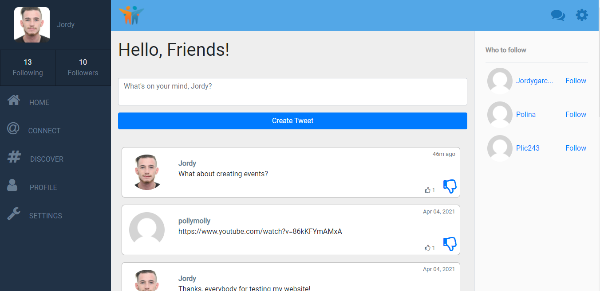

# Friends

A social media website build with Ruby on Rails, where you can create and like tweets, follow people and see their tweets on your timeline.



## Built With

- Ruby v2.7.0
- Ruby on Rails v5.2.4

## Live Demo

[Live demo](https://friends-official.herokuapp.com/)

## Getting Started

To get a local copy up and running follow these simple example steps.

### Prerequisites

Ruby: 2.6.3  
Rails: 5.2.3  
Postgres: >=9.5  
Rspec gem

### Setup

Install gems with:

```
$ bundle install
```

Setup database with:

```
$ rails db:create
$ rails db:migrate
```

## Usage

Start server with:

```
$ rails server
```

Open `http://localhost:3000/` in your browser.

**Jordy Garcia**

- Github: [](https://github.com/garciajordy/)
- Linkedin: [](https://www.linkedin.com/in/jordygarcia/)
- Twitter: [](https://twitter.com/JordyGarcia1994)

## Show your support

Give a ⭐️ if you like this project!

## Acknowledgments

- Hat tip to anyone whose code was used.
- Inspiration
- etc
